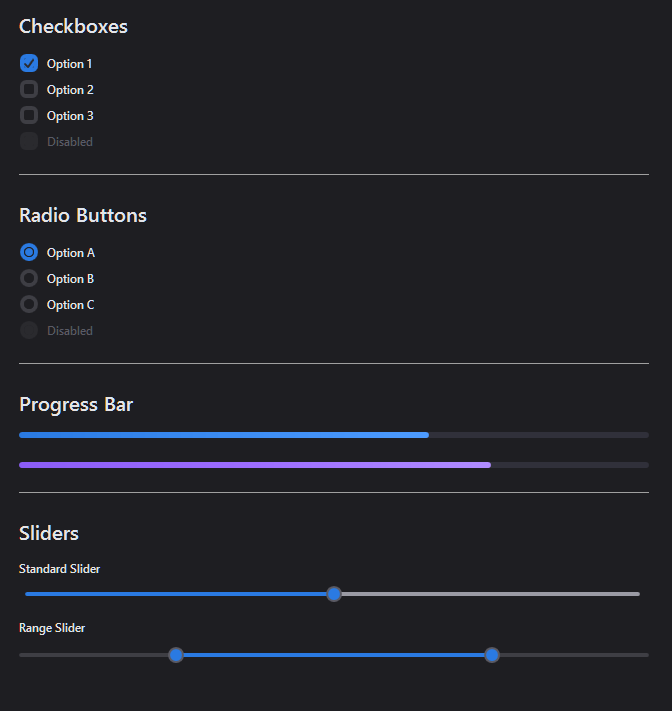
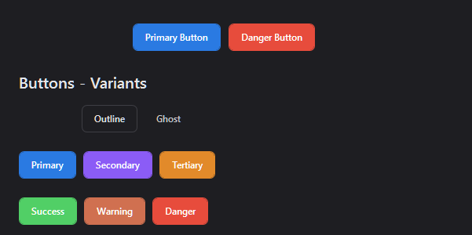
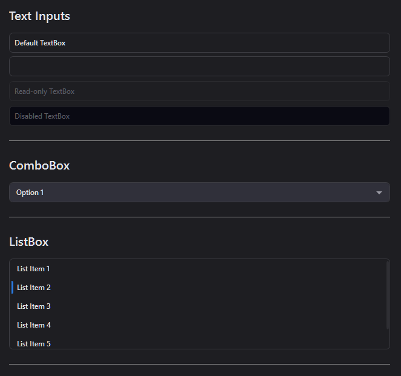
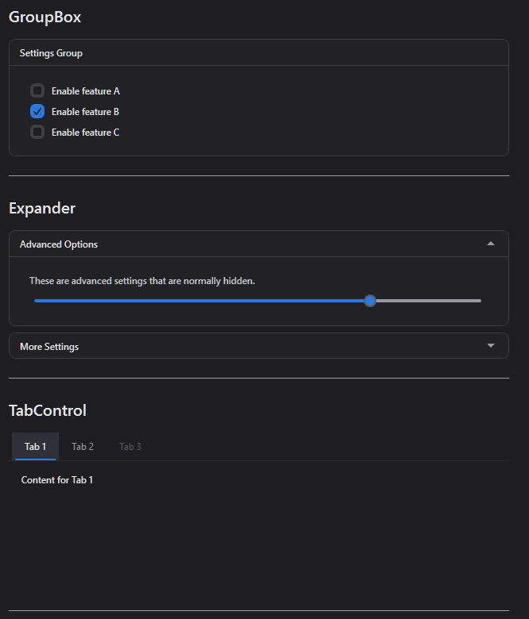
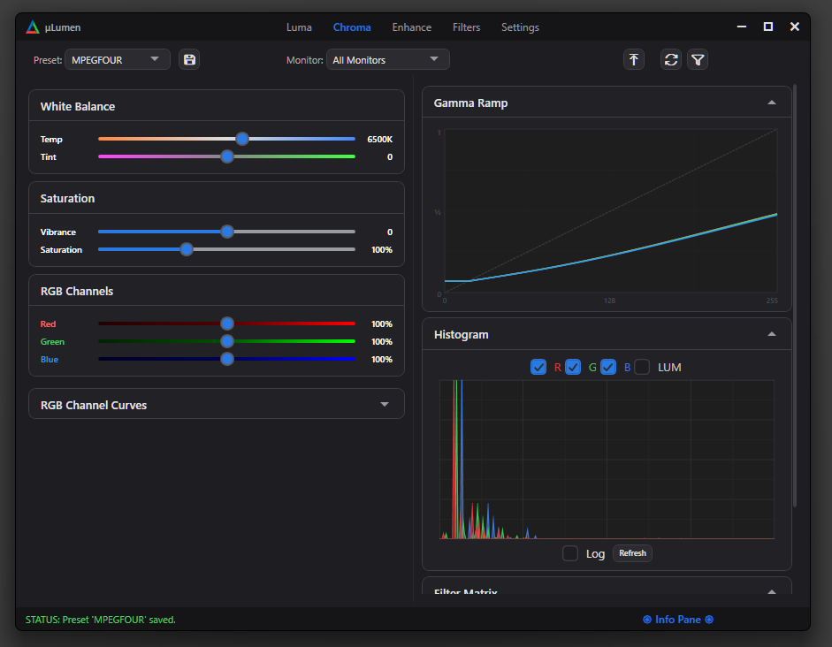

# TopazWPF

A dark-themed WPF control library and custom window chrome framework for .NET 8. I developed this in parallel to my first ever WPF projects, as I found the default UI lacking.  Current state is acceptable for personal projects, but it is still a WIP. 

Zero NuGet dependencies.

Provides a complete set of styled controls, a semantic token-based theme system [work in progress], and a custom borderless window with Mica backdrop, DWM rounded corners, and native resize handling — all through standard WPF project references.

Example Photos below...

## Features

- **CustomChromeWindow** — Borderless window base class with Mica/Acrylic backdrop, DWM dark mode, rounded corners, configurable caption bar, status bar, and native edge resize via `WM_NCHITTEST`
- **Semantic theme system** — WIP. All controls reference `DynamicResource` tokens (`Theme.Accent.Base`, `Theme.Brush.Surface.Dark`, etc.) so swapping one XAML dictionary re-skins the entire app
- **ThemeManager** — Runtime theme switching, dynamic accent color generation with auto-computed hover/pressed/subtle variants via hue rotation
- **20+ styled controls** — Button (Primary, Secondary, Tertiary, Danger, Success, Warning, Outline, Ghost), CheckBox, RadioButton, ComboBox, TextBox, Slider, ProgressBar, TabControl, ListBox, ListView, TreeView, GroupBox, Expander, ContextMenu, ScrollBar
- **Custom controls** — `RangeSlider` (two-thumb min/max), `RangeSeeker` (three-thumb with playhead)
- **Bundled fonts** — JetBrains Mono, Red Hat Display, Lucide icons, Material Icons

### IMPORTANT NOTE

There is considerable bloat with some of the theme system and button design - this is due to prototyping and being a bit indecisive on how I wanted to set up the architecture for the theme system.  Again... WIP.

## Quick Start

1. Add TopazWPF as a project reference.

2. Merge the resource dictionary in your `App.xaml`:

```xml
<Application.Resources>
    <ResourceDictionary>
        <ResourceDictionary.MergedDictionaries>
            <ResourceDictionary Source="/TopazWPF;component/Themes/Generic.xaml"/>
        </ResourceDictionary.MergedDictionaries>
    </ResourceDictionary>
</Application.Resources>
```

3. Inherit from `CustomChromeWindow` and apply the style:

```xml
<topaz:CustomChromeWindow x:Class="YourApp.MainWindow"
    xmlns:topaz="clr-namespace:TopazWPF.Windows;assembly=TopazWPF"
    Style="{StaticResource CustomChromeWindowStyle}"
    Title="Your App" Height="600" Width="800">

    <topaz:CustomChromeWindow.CaptionBar>
        <TextBlock Text="Your App" Style="{StaticResource CaptionTitleStyle}"/>
    </topaz:CustomChromeWindow.CaptionBar>

    <!-- Your content -->

</topaz:CustomChromeWindow>
```

4. Update your code-behind to inherit from `CustomChromeWindow`:

```csharp
public partial class MainWindow : CustomChromeWindow
{
    public MainWindow()
    {
        InitializeComponent();
    }
}
```

## Theming

Swap themes at runtime:

```csharp
ThemeManager.ApplyTheme("Themes/ThemeDark.xaml");
ThemeManager.SetPrimaryColor("#2A7AE2");
ThemeManager.GenerateTriadFromPrimary(); // auto-generates Secondary + Tertiary
```

Create a custom theme by copying `ThemeDark.xaml` and changing the color tokens. The theme dictionary must be index 0 in `MergedDictionaries`.

## Requirements

- .NET 8 (Windows)
- Windows 10 1809+ (Mica backdrop requires Windows 11)

## License

MIT


## Example Photos

Basic Controls:

 

Buttons:



Input/Selection:



More Controls:



Example App using Topaz:

